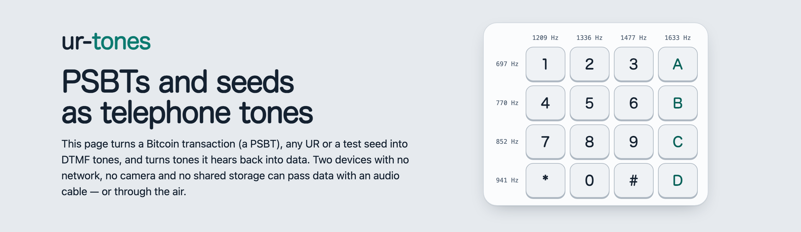
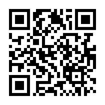
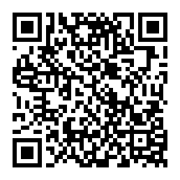

<picture>
  <source media="(prefers-color-scheme: dark)" srcset="docs/images/hero-dark.png">
  
</picture>

# ur-tones

Move Bitcoin data — PSBTs, seeds, xpubs, descriptors — as **telephone tones
(DTMF)**: through an audio cable, or through the air, between devices that
share no network, no camera and no storage. The same
[UR](https://github.com/BlockchainCommons/Research/blob/master/papers/bcr-2020-005-ur.md)
parts that animated QR codes carry, so a wallet that speaks UR only needs the
sound layer. And a seed can be keyed in by hand on any phone.

From the [NDS-Signer](https://github.com/ndssigner/nds-signer) project (an
air-gapped signer for the Nintendo DSi), but meant for any wallet or signer.
Its sister project, [Seedcraft](https://github.com/ndssigner/seedcraft),
backs seeds up as sequences of things.

**Why:** an air-gapped signer that needs no camera and no screen able to
show QR codes — a microcontroller, a small OLED, a microphone and a
speaker (or a headset jack) — and that can trade data with offline audio
gear (cassette, MiniDisc, MP3 players, voice recorders); plus seed backups
as tones encrypted with a PIN. See [docs/why.md](docs/why.md)
([español](docs/es/por-que.md)): SeedSigner compared with a ur-tones
signer, the devices it works with, and the backup's limits.

> ⚠️ **Draft.** The format can still change. Do not move the seed of real funds
> with a draft format.

## In short

- **Data mode**: a UR part per frame — lead-in, sync, a Reed-Solomon codeword
  (32 parity bytes) written in base 15 as the step from one tone to the
  next, so a tone **never follows itself**: an echo cannot pass for a second
  tone. Two misheard tones are always repaired, four almost always, and one
  lost or extra tone too. Long PSBTs go as multi-part URs with their fountain
  codes: a lost frame costs one frame.
- **Keypad mode**: a seed as `*`, the Standard SeedQR digits (four per word),
  `#`. Any phone can key it, at any pace. For cables and quiet rooms.
- **PIN for seeds**: so that whoever overhears or records the tones gets a
  different seed. Either side can make one up (🎲) for the other to type,
  and both show the seed's fingerprint, so a wrong PIN shows up at once.
  Transactions are not encrypted (they give no access to funds).
- **Pace**: by cable, 40 ms tones with 20 ms of silence (about 16 tones per
  second: a 450-byte PSBT in under 2 minutes); through the air, 80 + 80 ms.
- **Cables**: which ones, levels, and the Nintendo DSi's odd socket: see
  [SPEC.md §5](SPEC.md#5-cables).

See [SPEC.md](SPEC.md).

## Web tool

[`dist/ur-tones.html`](https://ndssigner.github.io/ur-tones/) — also in each
[release](https://github.com/ndssigner/ur-tones/releases), to use offline.
For wallets that do not speak tones yet:

- **Play**: paste a PSBT (from Sparrow: *Copy as Base64*, or open the `.psbt`
  file), UR texts or a test seed, and play them as tones — by cable or
  through the air — or save a WAV.
- **Listen** with the microphone (or open a WAV) and get the PSBT back, to
  paste into Sparrow (*File → Open Transaction → From Text*), with a live
  view of the level, the tones, the frames and the parts heard.

It is a single file that cannot connect anywhere: its Content-Security-Policy
forbids every network request, external script and `eval`; only its own
inline script and style run, pinned by their SHA-256. It stores nothing.
Check it with your operating system (`shasum -a 256 ur-tones.html`) against
the hash published with the release; `node web/build.mjs` rebuilds it byte
for byte. **For learning and testing**: handle real seeds only on an
air-gapped device.

## In this repository

- `SPEC.md`: the specification (draft v0).
- `reference/python/ur_tones.py`: reference implementation, standard library
  only; the frames and seeds also run on MicroPython.
- `c/ur_tones.{h,c}`: the same in C99 for small devices — frames, repairs,
  keypad mode, seed URs and PIN, tone synthesis and a streaming receiver —
  with no `malloc` and **no floating point** (integer Goertzel, a sine
  table): about 12 KB of ARM code, for CPUs without an FPU like the
  Nintendo DSi's (NDS-Signer). `tests/test_c.py` checks it against the
  vectors and the Python reference, audio included, both ways.
- `vectors/ur-tones-v0.json`: test vectors, public test seeds and testnet
  PSBTs only (`tools/gen_vectors.py`, cross-checked with the UR library
  SeedSigner bundles and with embit).
- `tests/test_reference.py`: vectors, error repair, and audio through a
  simulated acoustic channel (`tests/acoustic.py`: a small speaker, a room's
  echo, noise), at several paces and sample rates, and keyed at a person's
  pace.
- `web/`: the web tool (`web/test.mjs` checks it against the same vectors,
  Node's crypto and the simulated channel).

```bash
python3 tests/test_reference.py      # the Python reference
python3 tests/test_c.py              # the C library (needs cc)
node web/test.mjs                    # the JavaScript (Node.js ≥ 18)
node web/build.mjs                   # dist/ur-tones.html + its SHA-256
python3 tools/bundle.py v0.2.0       # the release zip, reproducible
python3 tools/readme_hero.py         # this README's picture (needs Chrome)
```

Recordings help most: if the tool misses tones in your setup, record what
it hears (*Listen → Record what is heard*) with a **test** seed or a testnet
PSBT, and attach the WAV to an issue.

## Donate

ur-tones is free and has no funding. Donations help keep it going:

<table>
<tr><td align="center"><br><b>Bitcoin</b><br><code>bc1qx5snc0wlc8cg9gwxhyx27y6pkru8rnngyq7uja</code></td>
<td align="center"><br><b>Lightning</b><br><code>ndssigner@coinos.io</code><br><sub>LNURL (for wallets without Lightning addresses):<br><code>LNURL1DP68GURN8GHJ7CM0D9HX7UEWD9HJ7TNHV4KXCTTTDEHHWM30D3H82UNVWQHKUERNWD5KWMN9WGQ8XE42</code></sub></td></tr>
</table>

The same addresses as [NDS-Signer](https://github.com/ndssigner/nds-signer#donate).

## License

MIT, see [LICENSE](LICENSE). The UR fountain codes are ported from Foundation
Devices' ur2 (BSD-2-Clause-Patent); the bytewords list is Blockchain
Commons'.
